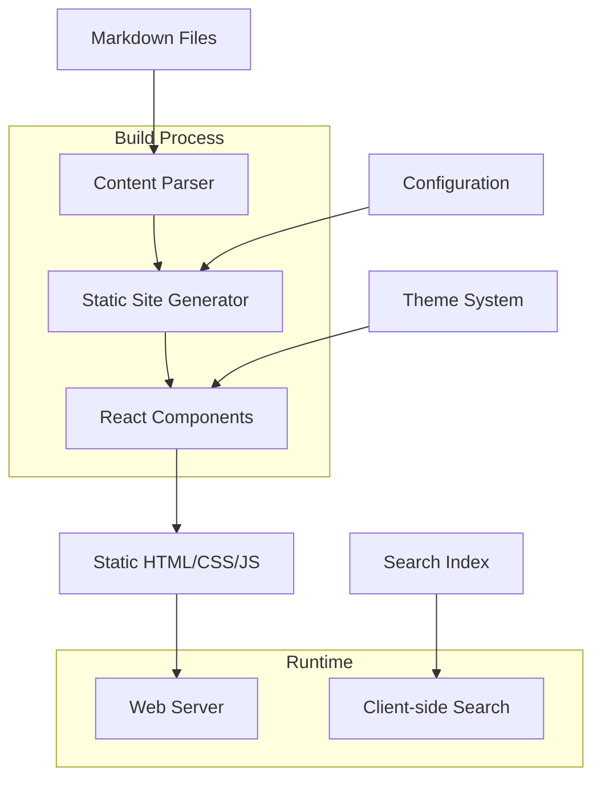

# Design Document

## Overview

ドキュメントサイトは、Next.jsベースの静的サイトジェネレーター（SSG）として設計されます。マークダウンファイルを読み込み、React コンポーネントとしてレンダリングし、静的HTMLファイルを生成します。レスポンシブデザイン、クライアントサイド検索、カスタマイズ可能なテーマシステムを提供します。

## Architecture

### High-Level Architecture



### Technology Stack

- **Frontend Framework**: Next.js 14 with App Router
- **Language**: TypeScript
- **Styling**: Tailwind CSS
- **Markdown Processing**: 
  - `remark` - Markdown parser
  - `rehype` - HTML processor
  - `remark-gfm` - GitHub Flavored Markdown support
  - `rehype-highlight` - Syntax highlighting
- **Search**: FlexSearch (client-side)
- **Icons**: Lucide React
- **Build Tool**: Next.js built-in bundler

## Components and Interfaces

### Core Components

#### 1. Layout Components
```typescript
// components/Layout.tsx
interface LayoutProps {
  children: React.ReactNode;
  navigation: NavigationItem[];
  currentPath: string;
}

// components/Sidebar.tsx
interface SidebarProps {
  navigation: NavigationItem[];
  currentPath: string;
  isOpen: boolean;
  onToggle: () => void;
}

// components/Header.tsx
interface HeaderProps {
  title: string;
  onMenuToggle: () => void;
}
```

#### 2. Content Components
```typescript
// components/MarkdownContent.tsx
interface MarkdownContentProps {
  content: string;
  frontmatter: FrontMatter;
}

// components/SearchBox.tsx
interface SearchBoxProps {
  onSearch: (query: string) => void;
  results: SearchResult[];
}
```

#### 3. Navigation Components
```typescript
// components/NavigationTree.tsx
interface NavigationTreeProps {
  items: NavigationItem[];
  currentPath: string;
  level?: number;
}
```

### Data Models

#### Content Models
```typescript
interface DocumentPage {
  slug: string;
  title: string;
  content: string;
  frontmatter: FrontMatter;
  lastModified: Date;
  path: string;
}

interface FrontMatter {
  title?: string;
  description?: string;
  date?: string;
  tags?: string[];
  order?: number;
}

interface NavigationItem {
  title: string;
  path: string;
  children?: NavigationItem[];
  order: number;
}
```

#### Search Models
```typescript
interface SearchResult {
  title: string;
  path: string;
  excerpt: string;
  score: number;
}

interface SearchIndex {
  id: string;
  title: string;
  content: string;
  path: string;
}
```

### Configuration Interface
```typescript
interface SiteConfig {
  title: string;
  description: string;
  baseUrl: string;
  docsDir: string;
  theme: {
    primaryColor: string;
    darkMode: boolean;
    customCss?: string;
  };
  navigation: {
    autoGenerate: boolean;
    customOrder?: string[];
  };
  search: {
    enabled: boolean;
    placeholder: string;
  };
}
```

## Architecture

### Directory Structure
```
documentation-site/
├── src/
│   ├── app/                    # Next.js App Router
│   │   ├── layout.tsx         # Root layout
│   │   ├── page.tsx           # Home page
│   │   └── [...slug]/         # Dynamic routes for docs
│   │       └── page.tsx
│   ├── components/            # React components
│   │   ├── Layout.tsx
│   │   ├── Sidebar.tsx
│   │   ├── Header.tsx
│   │   ├── MarkdownContent.tsx
│   │   ├── SearchBox.tsx
│   │   └── NavigationTree.tsx
│   ├── lib/                   # Utility functions
│   │   ├── markdown.ts        # Markdown processing
│   │   ├── navigation.ts      # Navigation generation
│   │   ├── search.ts          # Search functionality
│   │   └── config.ts          # Configuration loading
│   └── styles/                # Global styles
│       └── globals.css
├── docs/                      # Markdown documentation files
├── public/                    # Static assets
├── site.config.js            # Site configuration
├── package.json
├── next.config.js
├── tailwind.config.js
└── tsconfig.json
```

### Build Process Flow

1. **Content Discovery**: スキャンして`docs/`ディレクトリ内のマークダウンファイルを発見
2. **Content Processing**: マークダウンをパースし、フロントマターを抽出
3. **Navigation Generation**: ファイル構造とフロントマターから自動的にナビゲーション構造を生成
4. **Search Index Creation**: 全コンテンツから検索インデックスを作成
5. **Static Generation**: Next.jsのSSGで静的HTMLページを生成
6. **Asset Optimization**: CSS、JS、画像の最適化

### Runtime Architecture

#### Client-Side Routing
- Next.js App Routerによる動的ルーティング
- `[...slug]`パターンでドキュメントパスをキャッチ
- クライアントサイドナビゲーションによる高速ページ遷移

#### Search System
- ビルド時に全コンテンツから検索インデックスを生成
- FlexSearchによるクライアントサイド全文検索
- 検索結果のハイライト表示

#### Theme System
- CSS変数ベースのテーマシステム
- ダークモード対応
- カスタムCSSの注入サポート

## Error Handling

### Build Time Errors
- マークダウンファイルの構文エラー処理
- フロントマターの検証
- 循環参照の検出
- 不正なリンクの警告

### Runtime Errors
- 404ページの適切な表示
- 検索エラーのグレースフルハンドリング
- ナビゲーション状態の復旧

### Error Boundaries
```typescript
// components/ErrorBoundary.tsx
interface ErrorBoundaryState {
  hasError: boolean;
  error?: Error;
}

class DocumentationErrorBoundary extends React.Component<
  React.PropsWithChildren<{}>,
  ErrorBoundaryState
> {
  // Error boundary implementation
}
```

## Testing Strategy

### Unit Testing
- **Framework**: Jest + React Testing Library
- **Coverage**: コンポーネント、ユーティリティ関数
- **Focus**: マークダウン処理、ナビゲーション生成、検索機能

### Integration Testing
- **Scope**: ページレンダリング、ルーティング
- **Tools**: Playwright for E2E testing
- **Scenarios**: 
  - ページ間ナビゲーション
  - 検索機能の動作
  - レスポンシブデザインの確認

### Performance Testing
- **Metrics**: Core Web Vitals (LCP, FID, CLS)
- **Tools**: Lighthouse CI
- **Targets**: 
  - ページロード時間 < 2秒
  - 検索レスポンス時間 < 100ms

### Accessibility Testing
- **Standards**: WCAG 2.1 AA準拠
- **Tools**: axe-core, WAVE
- **Focus**: キーボードナビゲーション、スクリーンリーダー対応

## Performance Considerations

### Build Performance
- 増分ビルドサポート
- 並列処理によるマークダウン処理の高速化
- キャッシュ戦略の実装

### Runtime Performance
- 画像の最適化（Next.js Image component）
- コード分割とレイジーローディング
- 検索インデックスの効率的な読み込み

### SEO Optimization
- メタタグの自動生成
- 構造化データの追加
- サイトマップの自動生成